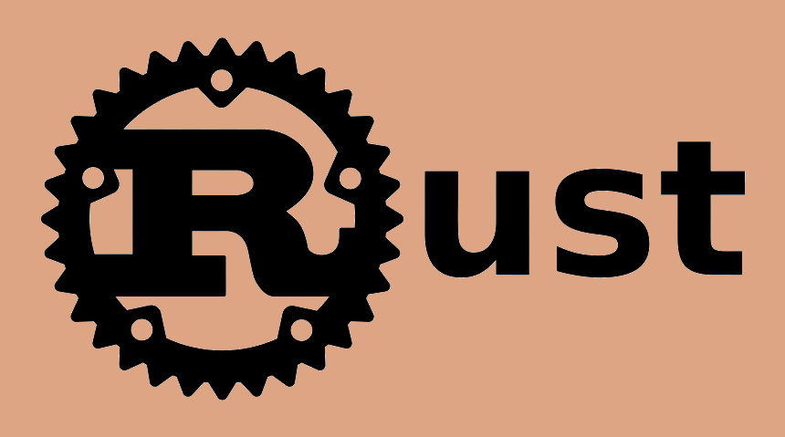
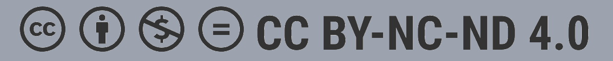

# Rust Book

A book for learning **Rust**, covering the language and its concepts in a practical way.

## License

This book is licensed under the [Creative Commons Attribution-NonCommercial-NoDerivatives 4.0 International License](./LICENSE).

You are free to:

* Read the book
* Download the book
* Share the original, unmodified book

You may **not**, without permission:

* Modify or rewrite the book
* Publish derivative versions
* Use the book for commercial purposes

If you'd like to create a translation, modification, adaptation, or otherwise use the book in a way not permitted by the license, please contact the [author](https://github.com/yok1rai) for permission.
