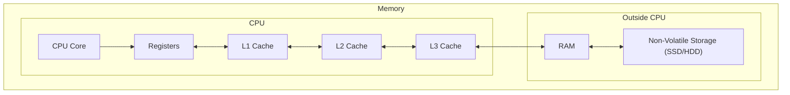
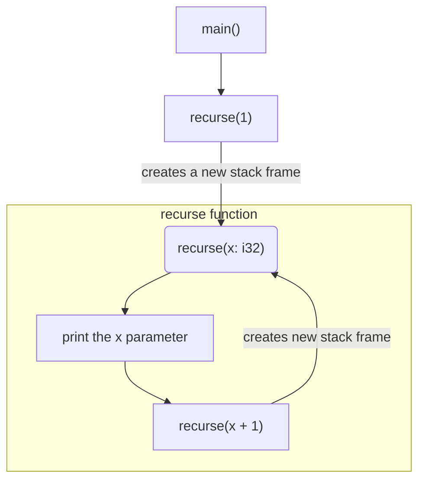
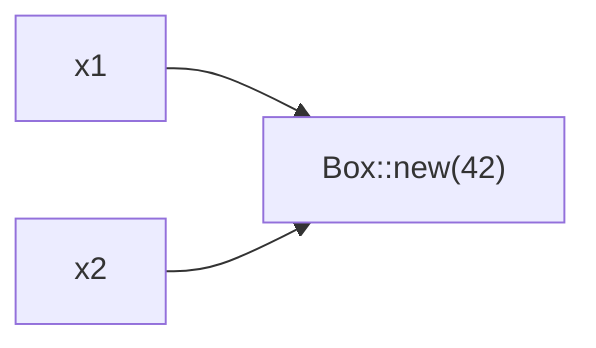
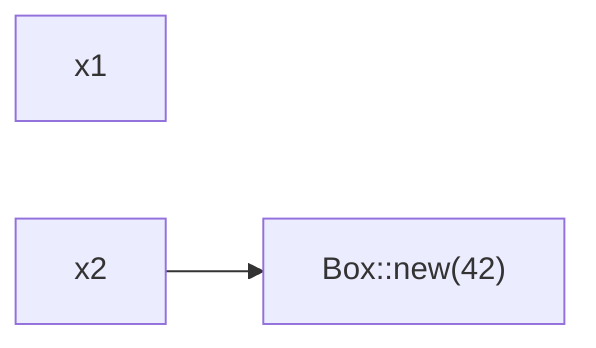

# Safe Code & Memory

## Why Safe Code Matters

One of the biggest risks in low-level programming is **undefined behavior (UB)**, a state where the language spec places no constraints on what the program does next. Anything could happen, and there's no way to reason about it.

Take this C snippet:

```c
#include <stdio.h>

int main() {
    int arr[] = {1, 2, 3}; // Only three elements exist

    printf("%d\n", arr[3]); // Reads the (nonexistent) fourth element

    return 0;
}
```

Compiling and running it:

```bash
$ gcc main.c -o main
$ ./main
-720905728
```

You get some odd number back. The reason isn't that the number is "randomly generated", it's that `arr[3]` points past the end of the array, into memory the array doesn't own. C simply doesn't define what should happen here, so whatever bytes happen to sit at that address get interpreted as an int.

Now the Rust equivalent:

```rust
fn main() {
    let arr = [1, 2, 3];

    println!("{}", arr[3]);
}
```

Rust refuses to compile this:

```bash
$ cargo run
   Compiling my_project v0.1.0 (/home/yok1rai/my_project)

error: this operation will panic at runtime
 --> src/main.rs:4:20
  |
4 |     println!("{}", arr[3]);
  |                    ^^^^^^ index out of bounds: the length is 3 but the index is 3
  |
  = note: `#[deny(unconditional_panic)]` on by default

error: could not compile `my_project` (bin "my_project") due to 1 previous error
```

Because the compiler can prove at compile time that index `3` is always invalid for a 3-element array, it stops the build outright rather than letting it ship.

When the index can't be determined ahead of time, Rust doesn't skip the check, it inserts a runtime bounds check instead. An invalid index at runtime causes a controlled panic, not a silent read of unrelated memory.

That's the essence of **memory safety** in Rust: out-of-bounds access is never allowed to happen quietly.


## What Memory Actually Is

To talk about memory safety meaningfully, it helps to first understand what "memory" refers to during program execution.

Every running program needs a place to keep its data, and the memory subsystem is what provides that. The CPU doesn't reach storage in one uniform way, it moves through a layered hierarchy of storage, trading size for speed at each level:



Registers and caches sit closest to the CPU and are tiny, fast, and mostly managed automatically by hardware (and, for registers, the compiler). Application code doesn't address this layer directly, it mostly deals with **RAM** as its working memory, so that's the level ownership and memory safety are really about.

## Addresses and Values

Think of memory as a long sequence of slots. Each slot has an **address** identifying it, and holds a **value**.

For example:

| Address | Value |
| :------ | ----: |
| `0x10`  |     1 |
| `0x14`  |     2 |
| `0x18`  |     3 |

Address `0x10` holds `1`, `0x14` holds `2`, and `0x18` holds `3`. (Real addresses and the gaps between them depend on the data type in question and the target system, these numbers are just illustrative.)

Say these three values make up an array: the array's data lives in that block of memory, spanning those three slots.

Now suppose the program tries to reach past `0x18`, looking for a fourth element. That element doesn't exist, there's nothing there that belongs to the array. This is exactly the situation where memory safety comes into play.

A safe programming language, like Rust, would not allow that.

## The Stack and the Heap

RAM isn't used as one undifferentiated block. Programs typically organize memory into different regions, with two of the most important being:

* the stack
* the heap

### The Stack

The stack is a region of memory that operates in a strict **last-in, first-out (LIFO)** order.

Whenever a function is called, a new **stack frame** is created for it. This frame contains things such as the function's local variables. When the function returns, its stack frame is removed, and the memory it occupied becomes available again.

Because this behavior is predictable, allocating and freeing stack memory is extremely cheap. In many cases, it essentially comes down to moving a stack pointer.

The trade-off is flexibility. Stack allocations generally need to have a known size and lifetime that fits within the function's execution.

For example:

```rust
fn main() {
    let x = 5;        // stored on the stack
    let arr = [1, 2, 3]; // also stored on the stack
}
```

Both `x` and `arr` have a fixed size known at compile time. When `main` returns, their stack storage is automatically reclaimed along with the rest of `main`'s stack frame.

#### Errors with the Stack

**Stack overflow.** the stack has a limited amount of memory. If you use more than it can hold, you will get `stack overflow` and program will crash

recursion is a classic example for that, basically a function that calls itself

```rust
fn recurse(x: i32) {
    println!("{x}");
    recurse(x + 1); // calls itself forever
}

fn main() {
    recurse(1); // start
}
```

```bash
$ cargo run
warning: function cannot return without recursing
 --> src/main.rs:1:1
  |
1 | fn recurse(x: i32) {
  | ^^^^^^^^^^^^^^^^^^ cannot return without recursing
2 |     println!("recurse {x}");
3 |     recurse(x + 1);
  |     -------------- recursive call site
  |
  = help: a `loop` may express intention better if this is on purpose
  = note: `#[warn(unconditional_recursion)]` on by default

warning: `my_project` (bin "my_project") generated 1 warning
    Finished `dev` profile [unoptimized + debuginfo] target(s) in 0.01s
     Running `target/debug/my_project`
recurse 1
recurse 2
recurse 3
recurse 4
recurse 5
recurse 6
recurse 7
recurse 8
recurse 9
recurse 10
recurse 11
recurse 12
recurse 13
recurse 14
recurse 15
recurse 16
recurse 17
recurse 18
recurse 19
recurse 20
recurse 21
recurse 22
recurse 23
recurse 24
recurse 25
recurse 26
recurse 27
recurse 28
recurse 29
recurse 30
recurse 31
recurse 32
recurse 33
recurse 34
recurse 35
recurse 36
recurse 37
recurse 38
recurse 39
recurse 40
recurse 41
recurse 42
recurse 43
.......
recurse 130823
recurse 130824
recurse 130825
recurse 130826
recurse 130827
recurse 130828
recurse 130829
recurse 130830
recurse 130831
recurse 130832
recurse 130833
recurse 130834
recurse 130835
recurse 130836
recurse 130837
recurse 130838
recurse 130839
recurse 130840
recurse 130841
recurse 130842
recurse 130843
recurse 130844
recurse 130845

thread 'main' (9631) has overflowed its stack
fatal runtime error: stack overflow, aborting
fish: Job 1, 'cargo run' terminated by signal SIGABRT (Abort)
```

this program works like that:



### The Heap

The heap is a region of memory used for **dynamic memory allocation**. It provides more flexibility than the stack, especially when the size or lifetime of data cannot be determined ahead of time.

Unlike the stack, heap memory isn't automatically reclaimed simply because a function returns. The program needs some mechanism to determine when the allocated memory is no longer needed and reclaim it.


Rust takes a different approach. The programmer can allocate data on the heap, but Rust's **ownership system** automatically determines when that memory should be freed.

A `String` is a good example:

```rust
fn main() {
    let x = String::from("Hello");
}
```

Here, `x` itself is stored on the stack. It contains information about the `String`, including a pointer to a buffer containing the actual `"Hello"` data, which is stored on the heap.

When `x` goes out of scope, Rust automatically frees the heap allocation associated with it.

So, in simple terms: the stack is fast and predictable, while the heap is flexible and dynamically managed.

#### Errors with the Heap

There are several mistakes you can make with the heap, though most of them are handled automatically by Rust.

**Memory leaks.** When you fail to free a heap allocation, that memory stays reserved even though it's no longer needed, wasting resources. A single leak or two usually isn't dangerous, but it becomes a real problem as leaks accumulate.

C example:

```c
int main() {
    int *x = malloc(sizeof(int));
    *x = 42;

    // forgot to call `free(x)`
}
```

Heap allocation is automatically managed by Rust, so memory leaks of this kind generally don't happen the way they do in C/C++.

**Use-after-free.** This is when memory is accessed after it's already been freed. In C, this leads to UB:

```c
#include <stdio.h>
#include <stdlib.h>

int main() {
    int *x = malloc(sizeof(int));
    *x = 42;
    free(x); // x is freed
    printf("%d\n", *x);
}
```

Running it:

```bash
$ gcc main.c -o main
$ ./main
1451899879
```

A classic case of UB, as you can see. In Rust, this situation isn't allowed to happen:

```rust
fn main() {
    let x = Box::new(42); // x is on the heap
    drop(x); // normally handled automatically, but you can free it manually too
    println!("{}", x);
}
```

```bash
$ cargo run
   Compiling my_project v0.1.0 (/home/yok1rai/my_project)
error[E0382]: borrow of moved value: `x`
 --> src/main.rs:4:20
  |
2 |     let x = Box::new(42);
  |         - move occurs because `x` has type `Box<i32>`, which does not implement the `Copy` trait
3 |     drop(x);
  |          - value moved here
4 |     println!("{}", x);
  |                    ^ value borrowed here after move
  |
help: consider cloning the value if the performance cost is acceptable
  |
3 |     drop(x.clone());
  |           ++++++++

For more information about this error, try `rustc --explain E0382`.
error: could not compile `my_project` (bin "my_project") due to 1 previous error
```

`drop(x)` consumes `x`, so by the time `println!` tries to use it, the compiler already considers it invalid, the same mechanism that makes the double-free below impossible.

**Double free.** This is when you free a heap allocation twice:

```c
#include <stdlib.h>

int main() {
    int *x = malloc(sizeof(int));
    *x = 42;
    free(x);
    free(x); // double-free
}
```

```bash
$ gcc main.c -o main
$ ./main
free(): double free detected in tcache 2
fish: Job 1, './main' terminated by signal SIGABRT (Abort)
```

Again, this is UB, depending on the system, it could lead to different behavior.

In Rust, a double free is impossible, because Rust guarantees that every heap allocation has exactly one owner responsible for dropping it. The same rule that stopped the use-after-free above, a value becomes invalid once it's moved or dropped, is what rules this out too: there's never a second owner left around to free the same memory again.

A classic example:

```rust
fn main() {
    let x1 = Box::new(42);
    let x2 = x1;
    println!("{x1}");
}
```

This fails to compile. When `x2 = x1` happens, Rust transfers ownership of the data from `x1` to `x2` and invalidates `x1`.

Why? Because if both `x1` and `x2` were considered valid owners of the same data, then when `x2` went out of scope and its data was dropped, `x1` would later try to drop the same data again, causing a double free.



Rust's solution is simple: move the data's ownership from `x1` to `x2`, and treat `x1` as no longer valid.

This is called a **move**, you can also trigger it explicitly with the `move` keyword in certain contexts (like closures).

before move:


after move:



If you want to keep `x1` usable, you can clone it with `.clone()`. Cloning a `Box` doesn't just copy the pointer, it allocates a brand-new block on the heap and copies the value into it, so `x1` and `x2` end up as two independent owners of two separate allocations:

```rust
fn main() {
    let x1 = Box::new(42);
    let x2 = x1.clone();
    println!("{x1} {x2}");
}
```

```bash
$ cargo run
   Compiling my_project v0.1.0 (/home/yok1rai/my_project)
    Finished `dev` profile [unoptimized + debuginfo] target(s) in 0.17s
     Running `target/debug/my_project`
42 42
```

That's why `.clone()` "uses additional resources", it's a real, separate allocation, not a cheap reference copy.

On the other hand, if `x1` is mutable, you can reassign it to a new heap allocation, since `x1`'s stack slot is still there, it's only the value it pointed to that moved into `x2`:

```rust
fn main() {
    let mut x1 = Box::new(42);
    let x2 = x1;
    x1 = Box::new(1);
    println!("{x1} {x2}");
}
```

```bash
$ cargo run
   Compiling my_project v0.1.0 (/home/yok1rai/my_project)
    Finished `dev` profile [unoptimized + debuginfo] target(s) in 0.17s
     Running `target/debug/my_project`
1 42
```

For stack-allocated values (like `i32`), there's no move, instead, the value is simply copied:

```rust
fn main() {
    let x1 = 42;
    let x2 = x1;
    println!("{x1} {x2}");
}
```

```bash
$ cargo run
   Compiling my_project v0.1.0 (/home/yok1rai/my_project)
    Finished `dev` profile [unoptimized + debuginfo] target(s) in 0.17s
     Running `target/debug/my_project`
42 42
```
