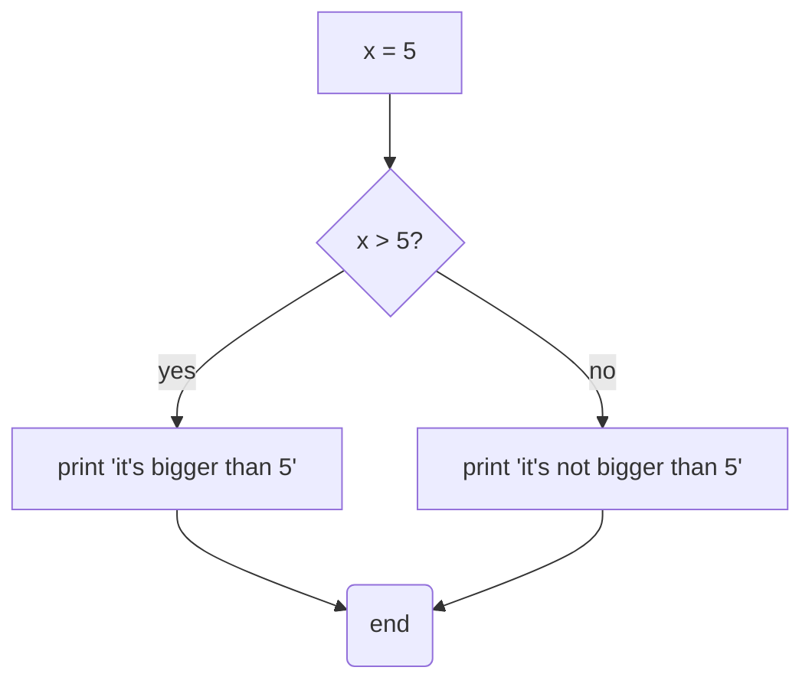
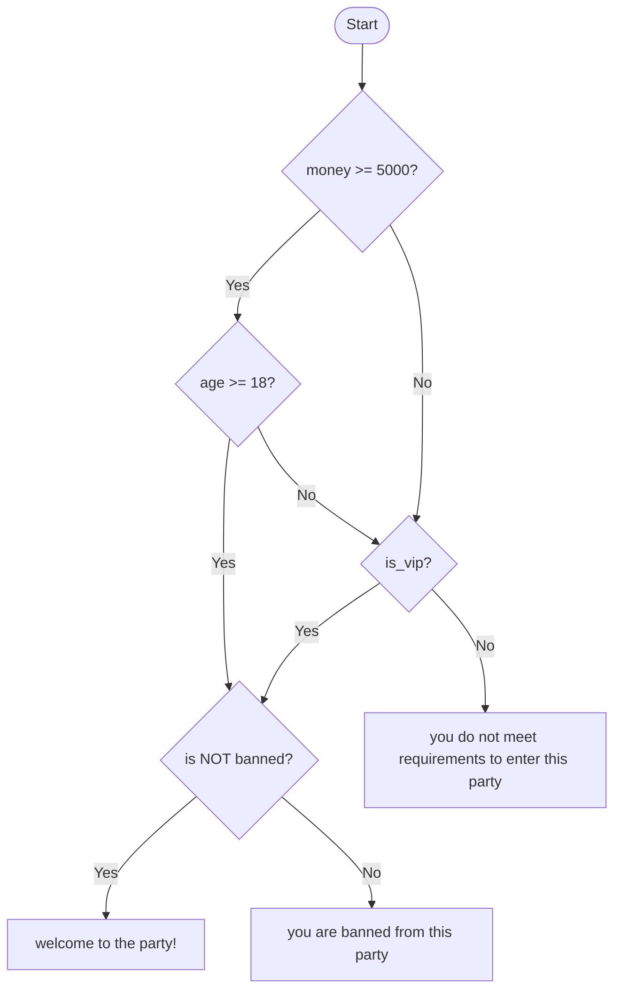

# Control Flow

The ability to redirect a program based on conditions is called control flow.

In a simple diagram:



In this chapter, we will learn how to make this.

## `if-else` Expression

An `if` statement allows you to branch your code depending on a condition.

For instance:

```rust
fn main() {
    let active = true;

    if active {
        println!("user is active");
    }
}
```

If the condition is not true, you can use the `else` statement.

```rust
fn main() {
    let active = true;

    if active {
        println!("user is active");
    } else {
        println!("user is not active");
    }
}
```

Let's test it:

```bash
$ cargo run
   Compiling my_project v0.1.0 (/home/yok1rai/my_project)
    Finished `dev` profile [unoptimized + debuginfo] target(s) in 0.12s
     Running `target/debug/my_project`
user is active
```

It will get even more dynamic as we learn how to take input.

Unlike Python, C, or JavaScript, Rust does not support truthiness.

> What is truthiness? Truthiness is when a value is treated as a boolean even though it isn't actually a boolean.
>
> For example, in C, any non-zero number is treated as `true`, while `0` is treated as `false`. In Python, empty collections such as lists and strings are treated as `false`.
>
> Rust does not have truthiness. Conditions must explicitly evaluate to a `bool` value.

For example:

```rust
fn main() {
    let x = 3;

    if x {
        println!("x is not zero");
    }
}
```

If it was a C or Python program, it would compile and print out something like "x is bigger than 0", but in Rust:

```bash
$ cargo run
   Compiling my_project v0.1.0 (/home/yok1rai/my_project)
error[E0308]: mismatched types
 --> src/main.rs:4:8
  |
4 |     if x {
  |        ^ expected `bool`, found integer

For more information about this error, try `rustc --explain E0308`.
error: could not compile `my_project` (bin "my_project") due to 1 previous error
```

### Comparison Operators

To use an integer in a condition, we need an expression that produces a bool. Comparison operators are one way to do that!

There are 6 comparison operators in Rust:

- `>`: bigger than
- `>=`: bigger or equal to
- `<`: less than
- `<=`: less or equal to
- `==`: equal to (don't confuse with `=`)
- `!=`: not equal to

Let's make a program that checks if a value is non-zero:

```rust
fn main() {
    let x = 3;
    if x != 0 {
        println!("x is not equal to zero");
    } else { // same as x == 0
        println!("x is zero")
    }
}
```

```bash
$ cargo run
   Compiling my_project v0.1.0 (/home/yok1rai/my_project)
    Finished `dev` profile [unoptimized + debuginfo] target(s) in 0.14s
     Running `target/debug/my_project`
x is not zero
```

We can program this example too:


```rust
fn main() {
    let x = 5;
    if x > 5 {
        println!("it's bigger than 5");
    } else {
        println!("it's not bigger than 5");
    }
}
```

And it would print out the second branch, since `5 > 5` is false.

### `else if` Expression

`else if` is a combination of `else` and `if`. It's checked only if the previous `if` condition is false, allowing you to check another condition.

```rust
fn main() {
    let age = 67;

    if age >= 65 {
        println!("you are old");
    } else if age >= 18 {
        println!("you are an adult");
    } else {
        println!("you are a kid");
    }
}
```

If we run the program, it will print `"you are old"`. This matters because if we'd used a separate `if` statement instead of `else if`, both conditions would trigger, since `67` is greater than or equal to both `65` and `18`.

With `else if`, once a condition is found to be true, the remaining conditions are skipped.

### Logical Operators

You can chain boolean values together, like "if one side is TRUE and the other side is TRUE," and so on.

There are 3 logical operators:

- `&&`: AND
- `||`: OR
- `!`: NOT

AND checks if both values are TRUE, OR checks if at least one value is TRUE, NOT flips the boolean value.

for && (AND):

|SIDE 1|SIDE 2|RESULT|
|:-----|:-----|:-----|
|FALSE |FALSE |FALSE |
|TRUE  |FALSE |FALSE |
|FALSE |TRUE  |FALSE |
|TRUE  |TRUE  |TRUE  |

for || (OR):

|SIDE 1|SIDE 2|RESULT|
|:-----|:-----|:-----|
|FALSE |FALSE |FALSE |
|TRUE  |FALSE |TRUE  |
|FALSE |TRUE  |TRUE  |
|TRUE  |TRUE  |TRUE  |

for ! (NOT):

It only takes one value.

|VALUE|RESULT|
|:----|:-----|
|TRUE |FALSE |
|FALSE|TRUE  |

Let's use them in a real program:

```rust
fn main() {
    let money = 20000;
    let age = 18;
    let is_vip = false;
    let is_banned = false;

    if (money >= 5000 && age >= 18) || is_vip {
        if !is_banned {
            println!("welcome to the party!");
        } else {
            println!("you are banned from this party");
        }
    } else {
        println!("you do not meet requirements to enter this party");
    }
}
```

In this program, we first check if money is greater than or equal to 5000, and then if age is greater than or equal to 18. These are two separate conditions, and both need to be true because we're using the `&&` (AND) operator. If both conditions are true, the entire expression becomes true.

We then use the `||` (OR) operator with `is_vip`. This means either the previous conditions must be true, or `is_vip` must be true. So even if someone doesn't have enough money or isn't 18 yet, they can still enter if they're a VIP.

If that condition is true, we then check `is_banned` using the `!` (NOT) operator. `!is_banned` means `is_banned` must be false. If the person isn't banned, we print "welcome to the party!". Otherwise, we print "you are banned from this party".

Conceptually, it's like this:



### Using `if` in a `let` Statement

Since `if` is an expression, you can use it in a `let` statement.

```rust
fn main() {
    let condition = true;
    let number = if condition { 5 } else { 6 };
    println!("The value of number is: {number}"); // 5
}
```

But of course, both branches must return the same type, since Rust is statically typed.

```rust
fn main() {
    let condition = true;
    let number = if condition { 5 } else { "hello" };
    println!("The value of number is: {number}");
}
```

```bash
$ cargo run
   Compiling my_project v0.1.0 (/home/yok1rai/my_project)
error[E0308]: `if` and `else` have incompatible types
 --> src/main.rs:3:44
  |
3 |     let number = if condition { 5 } else { "hello" };
  |                                 -          ^^^^^^^ expected integer, found `&str`
  |                                 |
  |                                 expected because of this

For more information about this error, try `rustc --explain E0308`.
error: could not compile `my_project` (bin "my_project") due to 1 previous error
```

## `match` Expression

`match` expressions are used for pattern matching, similar to `==`.

```rust
let number = 3;

match number {
    1 => println!("one"),
    2 => println!("two"),
    3 => println!("three"),
    _ => println!("something else")
}
```

Match statements are made of arms.

An arm is made of two parts:

```text
pattern => action,
pattern => action
```

Or you can add curly braces for multiple actions (it will return the last one, provided it has no semicolon):

```text
pattern => {
    action(s)
}
pattern => {
    action(s)
}
```

### `match` Expressions Are Exhaustive

Match statements must cover all possible values.

For example, this will not compile:

```rust
fn main() {
    let x = 1;

    match x {
        0 => println!("it's 0"),
        1 => println!("it's 1"),
    }
}
```

Because Rust doesn't know what to do if the value is 2, 6, or 1200.

If we run it:

```bash
$ cargo run
   Compiling my_project v0.1.0 (/home/yok1rai/my_project)
error[E0004]: non-exhaustive patterns: `i32::MIN..=-1_i32` and `2_i32..=i32::MAX` not covered
 --> src/main.rs:4:11
  |
4 |     match x {
  |           ^ patterns `i32::MIN..=-1_i32` and `2_i32..=i32::MAX` not covered
  |
  = note: the matched value is of type `i32`
help: ensure that all possible cases are being handled by adding a match arm with a wildcard pattern, a match arm with multiple or-patterns as shown, or multiple match arms
  |
6 ~         1 => println!("it's 1"),
7 ~         i32::MIN..=-1_i32 | 2_i32..=i32::MAX => todo!(),
  |

For more information about this error, try `rustc --explain E0004`.
error: could not compile `my_project` (bin "my_project") due to 1 previous error
```

Since manually listing every value would be absurdly long, we can use the `_` wildcard instead. It basically means "any other value."

```rust
fn main() {
    let x = 1;

    match x {
        0 => println!("it's 0"),
        1 => println!("it's 1"),
        _ => println!("any other value")
    }
}
```

And it will compile.

### `match` Is an Expression

Match statements are expressions, so they can return a value.

```rust
fn main() {
    let access = 2;
    // for reference, it is linux permission system
    let perms = match access {
        0 => (false, false, false),
        1 => (false, false, true),
        2 => (false, true, false),
        3 => (false, true, true),
        4 => (true, false, false),
        5 => (true, false, true),
        6 => (true, true, false),
        7 => (true, true, true),
        _ => {
            println!("invalid entry!");
            return;
        }
    };
    println!("your permissions are: {:?}", perms);
}
```

Since we entered 2, it will return `(false, true, false)`.

As for the `_` arm, it doesn't return `(bool, bool, bool)`, so how does that work? It's because of the never type.

### The Never Type

The never type is used when an expression never produces a value, because it never successfully finishes.

It's written as `!`.

For example:

```rust
fn forever() -> ! {
    loop {}
}
```

This is a never type because it's stuck in an unconditional loop.

Or here:

```rust
fn main() {
    let access = 2;
    // for reference, it is linux permission system
    let perms = match access {
        0 => (false, false, false),
        1 => (false, false, true),
        2 => (false, true, false),
        3 => (false, true, true),
        4 => (true, false, false),
        5 => (true, false, true),
        6 => (true, true, false),
        7 => (true, true, true),
        _ => {
            println!("invalid entry!");
            return;
        }
    };
    println!("your permissions are: {:?}", perms);
}
```

This part is a never type:

```rust
        _ => {
            println!("invalid entry!");
            return;
        }
```

Since it uses `return`, it immediately exits the function, which makes it impossible for the `perms` variable to ever receive a value from this arm.

#### The Never Type Can Become Any Type

The never type is very flexible, it's essentially treated as any type you need, because by definition it can never produce a value that would contradict that type.

That's why we didn't have to return `(bool, bool, bool)` from that arm, the never type is already compatible with that.

## Repetition with Loops

In Rust, there are several ways to repeat a block. It's often useful to repeat a code block forever, or until you explicitly tell it to stop.

These three are:

- `loop`
- `while`
- `for`

### Repeating Code with `loop`

The `loop` keyword is an unconditional loop, similar to `while true` in other languages, but Rust has an explicit block for that.

```rust
fn main() {
    loop {
        println!("hello world");
    }
}
```

```bash
$ cargo run
   Compiling my_project v0.1.0 (/home/yok1rai/my_project)
    Finished `dev` profile [unoptimized + debuginfo] target(s) in 0.16s
     Running `target/debug/my_project`
hello world
hello world
hello world
hello world
^Chello world
```

> The symbol `^C` represents when you hit `CTRL+C` to stop a program

Fortunately, Rust provides a way to stop an unconditional loop, and it's the `break` keyword.

Here's an example:

```rust
fn main() {
    let mut counter = 0;
    loop {
        if counter >= 10 {
            break;
        }
        println!("counter is at {counter}");
        counter += 1;
    }
}
```

```bash
$ cargo run
   Compiling my_project v0.1.0 (/home/yok1rai/my_project)
    Finished `dev` profile [unoptimized + debuginfo] target(s) in 0.17s
     Running `target/debug/my_project`
counter is at 0
counter is at 1
counter is at 2
counter is at 3
counter is at 4
counter is at 5
counter is at 6
counter is at 7
counter is at 8
counter is at 9
```

`loop` is an expression, which means it can return a value. How do we do that? With the `break` statement.

```rust
fn main() {
    let result = {
        let mut number = 1;

        loop {
            number *= 2;

            if number > 100 {
                break number;
            }
        }
    };
    println!("First power of 2 greater than 100: {result}");
}
```

```bash
$ cargo run
   Compiling my_project v0.1.0 (/home/yok1rai/my_project)
    Finished `dev` profile [unoptimized + debuginfo] target(s) in 0.18s
     Running `target/debug/my_project`
First power of 2 greater than 100: 128
```

If you don't want to end the loop, but just want to skip that iteration, you can use the `continue` keyword.

```rust
fn main() {
    let numbers = [1, 2, 3, 4, 5, 6, 7, 8, 9];
    let mut idx = 0;

    loop {
        if idx >= numbers.len() { // len() is a method that returns its length
            break;
        }
        if numbers[idx] % 2 == 0 {
            idx += 1;
            continue;
        }
        println!("{}", numbers[idx]);

        idx += 1;
    }
}
```

In this program, if the number is even, it skips printing it.

Let's run it:

```bash
$ cargo run
   Compiling my_project v0.1.0 (/home/yok1rai/my_project)
    Finished `dev` profile [unoptimized + debuginfo] target(s) in 0.17s
     Running `target/debug/my_project`
1
3
5
7
9
```

> note: this would be cleaner with a `for` loop, but we'll learn that shortly

### Disambiguating with Loop Labels

If you have loops within loops, `break` and `continue` apply to the innermost loop by default. You can optionally give a loop a label, then use that label with `break` or `continue` to specify that those keywords should apply to the labeled loop instead of the innermost one. Loop labels must begin with a single quote.

```rust
fn main() {
    let mut count = 0;

    'counting_up: loop {
        println!("count = {count}");
        let mut remaining = 10;

        loop {
            println!("remaining = {remaining}");
            if remaining == 9 {
                break;
            }
            if count == 2 {
                break 'counting_up;
            }
            remaining -= 1;
        }
        count += 1;
    }
    println!("end count = {count}");
}
```

If we run that:

```bash
$ cargo run
   Compiling my_project v0.1.0 (/home/yok1rai/my_project)
    Finished `dev` profile [unoptimized + debuginfo] target(s) in 0.18s
     Running `target/debug/my_project`
count = 0
remaining = 10
remaining = 9
count = 1
remaining = 10
remaining = 9
count = 2
remaining = 10
end count = 2
```

### Repetition with a Conditional `while` Loop

A `while` loop is a conditional loop that stops as soon as its condition is no longer true.

For instance:

```rust
fn main() {
    let mut x = 3;
    while x > 0 {
        println!("{x}");
        x -= 1;
    }
}
```

This is a conditional loop, let's run it:

```bash
$ cargo run
   Compiling my_project v0.1.0 (/home/yok1rai/my_project)
    Finished `dev` profile [unoptimized + debuginfo] target(s) in 0.19s
     Running `target/debug/my_project`
3
2
1
```

One of the biggest downsides of a `while` loop is that it can't meaningfully return a value (it's technically an expression, but it always evaluates to `()`).

So you can't use it in a `let` statement to get a value out of it.

If we try to:

```rust
fn main() {
    let mut x = 3;
    let result = while x > 0 {
        if x > 0 {
            break x;
        }
        x -= 1;
    };
    println!("{:?}", result);
}
```

It would fail:

```bash
$ cargo run
   Compiling my_project v0.1.0 (/home/yok1rai/my_project)
error[E0571]: `break` with value from a `while` loop
 --> src/main.rs:5:13
  |
3 |     let result = while x > 0 {
  |                  ----------- you can't `break` with a value in a `while` loop
4 |         if x > 0 {
5 |             break x;
  |             ^^^^^^^ can only break with a value inside `loop` or breakable block
  |
help: use `break` on its own without a value inside this `while` loop
  |
5 -             break x;
5 +             break;
  |

For more information about this error, try `rustc --explain E0571`.
error: could not compile `my_project` (bin "my_project") due to 1 previous error
```

### Looping Through a Collection with a `for` Loop

Remember this example from the `continue` section?

```rust
fn main() {
    let numbers = [1, 2, 3, 4, 5, 6, 7, 8, 9];
    let mut idx = 0;

    loop {
        if idx >= numbers.len() {
            break;
        }
        if numbers[idx] % 2 == 0 {
            idx += 1;
            continue;
        }
        println!("{}", numbers[idx]);

        idx += 1;
    }
}
```

We could rewrite this with a `while` loop:

```rust
fn main() {
    let numbers = [1, 2, 3, 4, 5, 6, 7, 8, 9];
    let mut idx = 0;

    while numbers.len() > idx {
        if numbers[idx] % 2 == 0 {
            idx += 1;
            continue;
        }
        println!("{}", numbers[idx]);

        idx += 1;
    }
}
```

But this is still risky (out-of-bounds errors), easy to get wrong, and a bit long.

For example, if we accidentally changed the condition to `while numbers.len() >= idx`, this would happen:

```bash
$ cargo run
   Compiling my_project v0.1.0 (/home/yok1rai/my_project)
    Finished `dev` profile [unoptimized + debuginfo] target(s) in 0.16s
     Running `target/debug/my_project`
1
3
5
7
9

thread 'main' (9185) panicked at src/main.rs:6:12:
index out of bounds: the len is 9 but the index is 9
note: run with `RUST_BACKTRACE=1` environment variable to display a backtrace
```

It would crash during runtime.

Instead, we can use a `for` loop, which iterates over an entire collection for us.

Its syntax is simple:

```rust
for item in collection
```

Let's rewrite the same logic with a `for` loop:

```rust
fn main() {
    let numbers = [1,2,3,4,5,6,7,8,9];

    for number in numbers {
        if number % 2 == 0 {
            continue;
        }
        println!("{number}");
    }
}
```

```bash
$ cargo run
   Compiling my_project v0.1.0 (/home/yok1rai/my_project)
    Finished `dev` profile [unoptimized + debuginfo] target(s) in 0.19s
     Running `target/debug/my_project`
1
3
5
7
9
```

#### Range

You may have heard of `range()` in Python, well Rust has a similar, and even more powerful, version of that.

Basically, a range lets you create a sequence of values.

There are 2 versions of it in Rust:

- `MIN..MAX`: exclusive range, MAX is excluded
- `MIN..=MAX`: inclusive range, MAX is included

It's used with `for` loops a lot.

Let's test it out:

```rust
fn main()  {
    for i in 1..5 {
        println!("{i}");
    }
}
```

```bash
$ cargo run
   Compiling my_project v0.1.0 (/home/yok1rai/my_project)
    Finished `dev` profile [unoptimized + debuginfo] target(s) in 0.14s
     Running `target/debug/my_project`
1
2
3
4
```

With an inclusive range:

```rust
fn main()  {
    for i in 1..=5 {
        println!("{i}");
    }
}
```

```bash
$ cargo run
   Compiling my_project v0.1.0 (/home/yok1rai/my_project)
    Finished `dev` profile [unoptimized + debuginfo] target(s) in 0.14s
     Running `target/debug/my_project`
1
2
3
4
5
```

You can even reverse it using `.rev()`, but first you need to wrap it in parentheses.

```rust
fn main() {
    for i in (1..4).rev() {
        println!("{i}!");
    }
    println!("LIFTOFF!!!");
}
```

```bash
$ cargo run
   Compiling my_project v0.1.0 (/home/yok1rai/my_project)
    Finished `dev` profile [unoptimized + debuginfo] target(s) in 0.15s
     Running `target/debug/my_project`
3!
2!
1!
LIFTOFF!!!
```
